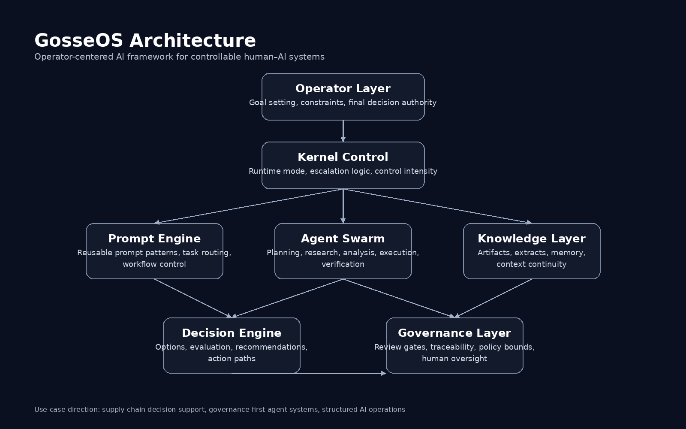

# GosseOS Framework

GosseOS is an operator-centered AI framework designed to structure complex human–AI workflows.

The project explores how AI systems can be organized as modular architectures instead of isolated prompt interactions.

---

## Core Concepts
Operator-driven AI workflows  
Modular agent architecture  
Decision-support systems  
Governance-aware AI execution  

---

## Architecture

Operator  
↓  
Prompt Framework  
↓  
Agent Layer  
↓  
Decision Engine  
↓  
Governance Layer  
↓  
Use Cases  

---

## Example Use Case

Supply Chain Decision Support

The framework can structure logistics decision processes by combining:

• data interpretation  
• rule-based governance  
• AI-assisted reasoning  

---

## Project Structure

docs/  
architecture/  
modules/  
use-cases/  

---

## Vision

Treat AI systems as structured operating architectures rather than simple prompt tools.
